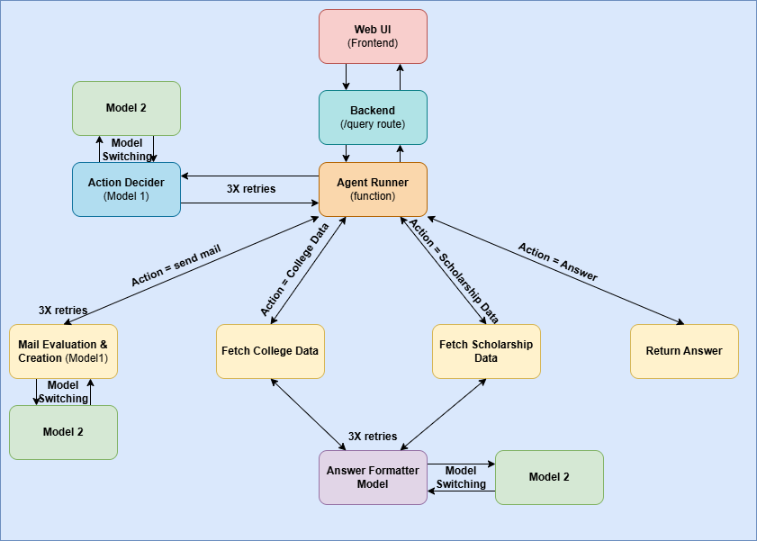

# HackZenith Backend

This is the backend service for the HackZenith project. It is built using **FastAPI** and leverages **Google's Generative AI (Gemini)** to provide an intelligent agent capable of answering queries about college admissions, placements, scholarships, and automating email drafting and sending.

## 📂 Project Structure

The backend is organized into a modular structure:

- **`main.py`**: The entry point of the FastAPI application.
- **`Agents/`**: Core logic for the AI agent.
  - **`agent_runner.py`**: Manages the agent's execution flow.
  - **`orchestrator.py`**: Routes actions to specific APIs (College, Scholarship, Mail).
  - **`frontlayer_agent/`**: Handles the decision-making process using LLMs.
  - **`College_API/`**: Modules for fetching college-related data (Admission, Placements, etc.).
  - **`Scholarship_API/`**: Modules for scholarship information.
  - **`send_mail/`**: Functionality for drafting and sending emails.
- **`data/`**: JSON files containing static data for the APIs.

## 🚀 Setup & Installation

### 1. Prerequisites
- Python 3.9 or higher (Python 3.13 is preferred)
- Git

### 2. Clone the Repository
If you haven't already, clone the main repository and navigate to the `Backend` directory:
```bash
git clone https://github.com/ItsRikan/ZenithProject.git
cd ZenithProject/Backend
```

### 3. Create a Virtual Environment (Recommended)
```bash
python -m venv venv
# Windows
.\venv\Scripts\activate
# Linux/Mac
source venv/bin/activate
```

### 4. Install Dependencies
```bash
pip install -r requirements.txt
```

## ⚙️ Configuration

### Environment Variables
Create a `.env` file in the `Backend` directory with the following keys:

```env
GOOGLE_API_KEY=your_gemini_api_key_here
GMAIL_PASSWORD=your_app_password_here
```

> **Note**: For `GMAIL_PASSWORD`, use an App Password generated from your Google Account security settings, not your regular login password.

### Email Configuration
To enable email functionality, you need to configure the sender and department emails:

1. Open `Agents/details.py`.
2. Update the `SENDER_EMAIL` and the `DEPT_TO_MAILS` dictionary with the appropriate email addresses for different departments (INFO, PAYMENT, MANAGEMENT).

## 🏃 Run the Server

Start the development server using Uvicorn:

```bash
uvicorn main:app --reload
```

The server will start at `http://127.0.0.1:8000`.

## 🔌 API Endpoints

| Method | Endpoint | Description |
| :--- | :--- | :--- |
| `GET` | `/` | Health check to verify the server is running. |
| `POST` | `/query` | Main endpoint for user queries. Handles intent recognition and executes relevant actions (answer, fetch data, etc.). |
| `POST` | `/send_mail` | Endpoint to send emails for specific departments. |
