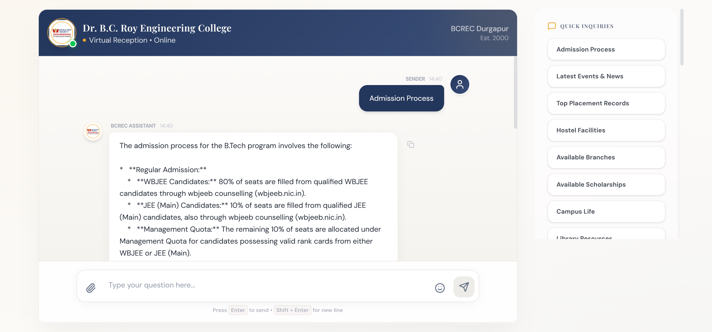
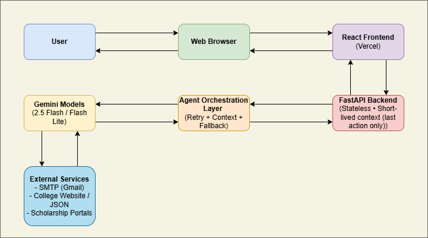

# HackZenith Project

## Problem Statement
During peak periods like admissions and registration, colleges face overwhelming inquiry volumes that lead to long wait times, missed calls, and delayed responses. Limited receptionist availability and manual handling of inquiries and appointments result in scheduling conflicts, miscommunication, and inefficient use of staff resources, especially in smaller institution, ultimately reducing student satisfaction and engagement. 

## Architecture Diagram

## Solution
The agent provides analytics for insights, and personalized responses, scaling effortlessly for enrollment surges while integrating with campus CRMs.
- **Staff Efficiency:**\
Frees personnel from routine calls, saving up to 30% time for complex tasks like counseling.
- **Scalability:**\
Manages inquiry spikes during admissions without added costs, plus analytics for service improvements.
- **Enhanced Engagement:**\
Offers crisis alerts, event coordination, and accessibility features, boosting student satisfaction and retention.

## How It Solves The Problem
- 24/7 availability
- Reduced manual enquiries
- Faster resolution & routing
- Trustworthy responses

## Features
- **Instant college Q&A:**\ 
Fast, accurate answers to admissions, departments, placements, and general college queries.
- **Lightweight context management:**\
Remembers the last action taken by the user to maintain continuity across follow-up questions.                
- **Agent-driven mailing system:**\
Automatically drafts and sends emails for reporting issues, enquiries, or personal requests to the correct department. The AI agent intelligently filters and rejects unnecessary or irrelevant emails
- **Official college data retrieval:**\
Fetches structured college information via maintained APIs / curated datasets.
- **Resilient AI architecture:**\
3-retry strategy with automatic model switching and timeouts to ensure responses even during model failures.
- **Efficient & cost-aware API usage:**\
Optimized prompting, selective model calls, and lightweight orchestration to minimize latency and API usage.

## Used Technologies
- Google-generative AI (Python SDK)
- Gemini Models (Gemini-2.5-Flash & Gemini-2.5-Flash-Lite)
- SMTP Server (smtp.gmail.com port:587)
- FastAPI (Backend)
- React (Frontend)
